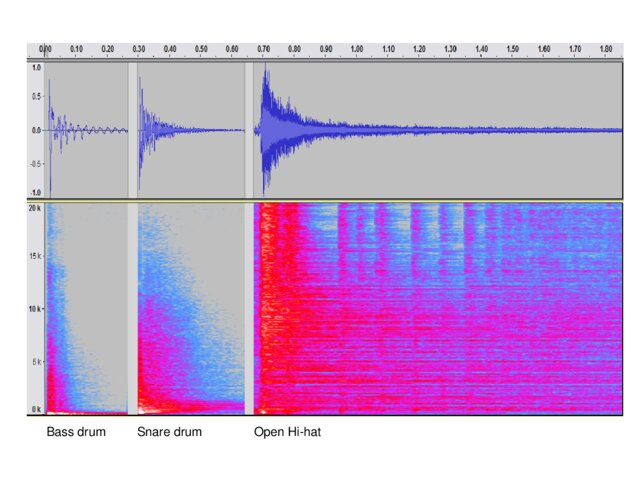

# Final Project: Drum Kit

## Description of expected behavior

* The programmed Nexys A7-100T will act as a drum kit module and generate a waveform mimicking a snare drum, bass drum, hi-hat, and crash cymbal.

	* The drum kit will require a Pmod I2S2 sterio audio I/O interface with an accompanying speaker.

 * Which waveform is best for which instrument?

   


 	* Each instrument has a different set of characteristics, timbres, and material properties that give way to unique sound.
  	* **Bass drum**: Low frequency, begins with strong attack and smooth decay
   	* **Snare drum**: Medium frequency, begins with a strong attack and a sharp decay
   	* **Hi-hat**: High frequency, begins with a sharp attack and a sharp decay (closed) or long decay (open)

## Summary of Steps
### 1. Create a new RTL project _drum_kit_ in Vivado Quick Start

* Create five new source files of file type VHDL called **drum.vhd**, **drumkit.vhd**, **tone.vhd**, **wail.vhd**, and **dac_if.vhd**

	* drumkit.vhd, tone.vhd, wail.vhd, and dac_if.vhd are all mostly taken from **Lab 5**. Minor edits were made to all except drumkit.vhd, where a bulk of the process takes place.
 
* Create a new constraint file of file type XDC called **drum.xdc**

* Choose Nexys A7-100T board for the project

* Click 'Finish'

* Click design sources and copy the VHDL code from .vhd files

* Click constraints and copy the code from the .xdc

### 2. Run synthesis

### 3. Run implementation

### 3b. (optional, generally not recommended as it is difficult to extract information from and can cause Vivado shutdown) Open implemented design

### 4. Generate bitstream, open hardware manager, and program device

* Click 'Generate Bitstream'

* Click 'Open Hardware Manager' and click 'Open Target' then 'Auto Connect'

* Click 'Program Device' then xc7a100t_0 to download drumkit.bit to the Nexys A7-100T board

* Push BTNC, BTNU, or BTNL to generate a sound per click. 

## Description of Project & Additions 

* Instantiated each drum component as a sub-component of wail.vhd in a new drumkit.vhd file, which stems from siren.vhd

* In the architecture, 3 constants were defined for the bass, snare, and hihat (in order of increasing frequency). 3 audio outputs were also created to handle individualizing each sound so there was no overlap or error.

```vhdl
    CONSTANT bass_tone : UNSIGNED (13 DOWNTO 0) := to_unsigned(300, 14); 
    CONSTANT snare_tone : UNSIGNED (13 DOWNTO 0) := to_unsigned(400, 14); 
    CONSTANT hihat_tone : UNSIGNED (13 DOWNTO 0) := to_unsigned(500, 14); 
```

```vhdl
    SIGNAL bass_audio, snare_audio, hihat_audio : SIGNED (15 DOWNTO 0); 
```

* We then instantiated 3 instances of wail for the bass, snare, and hihat. We mapped a component's tone to both lo-tone and hi-tone as we did not want the pitch to modulate for an individual component. wspeed was set to a constant as well as a wailing effect would not provide a constant tone. audio_data was then mapped accordingly for each output. This all successfully handled the creation of each component, but we now need a method to emit a sound only for a button press.

```vhdl
    bass : wail
        PORT MAP (
            lo_pitch => bass_tone,
            hi_pitch => bass_tone,
            wspeed => to_unsigned(0, 8), 
            wclk => slo_clk,
            audio_clk => audio_CLK,
            audio_data => bass_audio
        );

    snare : wail
        PORT MAP (
            lo_pitch => snare_tone,
            hi_pitch => snare_tone,
            wspeed => to_unsigned(0, 8),
            wclk => slo_clk,
            audio_clk => audio_CLK,
            audio_data => snare_audio
        );

    hihat : wail
        PORT MAP (
            lo_pitch => hihat_tone,
            hi_pitch => hihat_tone,
            wspeed => to_unsigned(0, 8), 
            wclk => slo_clk,
            audio_clk => audio_CLK,
            audio_data => hihat_audio
        );
```

* To handle the button control, a process was defined dependent on the 3 buttons and 3 component audio signals. Similar to Lab 5, we set ```data_L``` to our desired audio signal if a button was pressed (btn = '1'). We had issues with sound playing without any buttons being pressed, so we added the ELSE condition which outputs a 0 if no event occurs. ```data_R``` was set to ```data_L``` for simplification, but further exploration could lead us to play components in separate channels.

```vhdl
    PROCESS (btnc, btnu, btnl, bass_audio, snare_audio, hihat_audio)
    BEGIN
        IF btnc = '1' THEN
            data_L <= bass_audio; 
        ELSIF btnu = '1' THEN
            data_L <= snare_audio; 
        ELSIF btnl = '1' THEN
            data_L <= hihat_audio; 
        ELSE
            data_L <= (OTHERS => '0'); 
        END IF;

        data_R <= data_L;
    END PROCESS;
```

* To complete the button mapping, we added the 5 buttons in drum.xdc.

```vhdl
set_property -dict { PACKAGE_PIN N17   IOSTANDARD LVCMOS33 } [get_ports { btnc }]; #IO_L9P_T1_DQS_14 Sch=btnc
set_property -dict { PACKAGE_PIN M18   IOSTANDARD LVCMOS33 } [get_ports { btnu }]; #IO_L4N_T0_D05_14 Sch=btnu
set_property -dict { PACKAGE_PIN P17   IOSTANDARD LVCMOS33 } [get_ports { btnl }]; #IO_L12P_T1_MRCC_14 Sch=btnl
set_property -dict { PACKAGE_PIN M17   IOSTANDARD LVCMOS33 } [get_ports { BTNR }]; #IO_L10N_T1_D15_14 Sch=btnr
set_property -dict { PACKAGE_PIN P18   IOSTANDARD LVCMOS33 } [get_ports { BTND }]; #IO_L9N_T1_DQS_D13_14 Sch=btnd
```

## Issues Faced

* Originally we wanted to implement the keypad from Lab 4, however we struggled combining the two .xdc files with separate clocks, and opted for the onboard buttons instead.

* We also attempted to add a decay to each note to better simulate an acoustic instrument, however adding a decay rate and modifying the triangle wave proved too difficult in the time allotted.  

## Video of 3-component Drum Kit

[Here is a link to view a quick video of our project.](https://youtu.be/vDN9RkzP1cc)

## Work Division

* Harry - Implemented component instantiation, researched different waveforms to attempt to use, tried to add (and later decided to remove) audio decay

* Greyson - Set up constraint file, created basic method of changing tone (finalized by Harry), first attempts at drum kit by modifying the wave_speed signal
